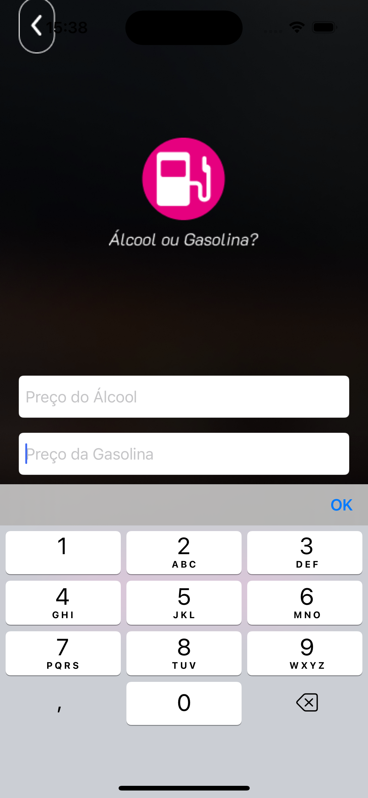

# Gasolina ou Alcool
> Aplicativo para desenvolvimento Swift/iOS em ViewCode

## Setup Inicial do Projeto

Após criar o projeto deve-se retirar as referências e arquivos de storyboard.

* Excluir o arquivo storyboard da raiz do projeto
* Acessar o arquivo Info.plist da raiz do projeto, buscar por "Storyboard Name - Main" e excluir a linha
* Acessar o project, ir na aba "Build Settings", buscar por "UIKit Main Storyboard File Base Name" e apagar a referência ao "main", deixando o campo em branco.
* Acessar o arquivo SceneDelegate e editar a função "willConnectTo" para:

```swift

func scene(_ scene: UIScene, willConnectTo session: UISceneSession, options connectionOptions: UIScene.ConnectionOptions) {
        guard let windowScene = (scene as? UIWindowScene) else { return }
        let window = UIWindow(windowScene: windowScene)
        let vc: ViewController = ViewController()
        let nav = UINavigationController(rootViewController: vc)
        window.rootViewController = nav
        window.makeKeyAndVisible()
        self.window = window
    }

```

## Criar accessoryView acima do teclado

* Criar um arquivo Swift file
* Extender a classe UITextField

```swift

import Foundation
import UIKit

extension UITextField {
    
    func addDoneButtonOnKeyboard() {
        
        let doneToolbar: UIToolbar = UIToolbar(frame: CGRect.init(x: 0, y: 0, width: UIScreen.main.bounds.width, height: 50))
        doneToolbar.barStyle = .default
        
        let flexSpace = UIBarButtonItem(barButtonSystemItem: .flexibleSpace, target: nil, action: nil)
        let done = UIBarButtonItem(title: "OK", style: .done, target: self, action: #selector(doneButtonAction))
   
        let items = [flexSpace, done]
        doneToolbar.items = items
        doneToolbar.sizeToFit()
        self.inputAccessoryView = doneToolbar
    }
    
    @objc func doneButtonAction() {
        self.resignFirstResponder()
    }
}
```

* No objeto UITextField invocar o método obj.addDoneButtonOnKeyboard()
 


## Snapshots

  
<br/>

 
<br/> 

  
<br/>

 
<br/> 